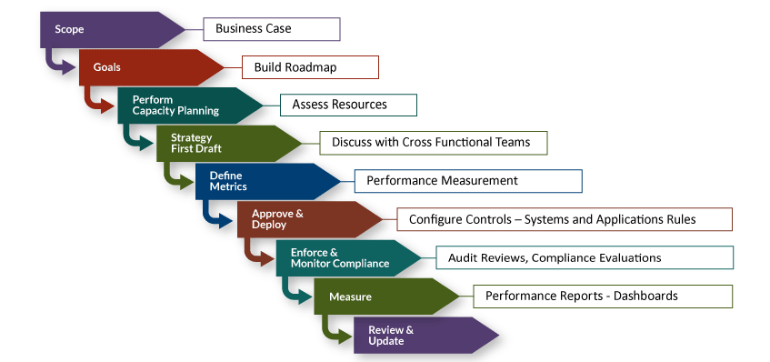
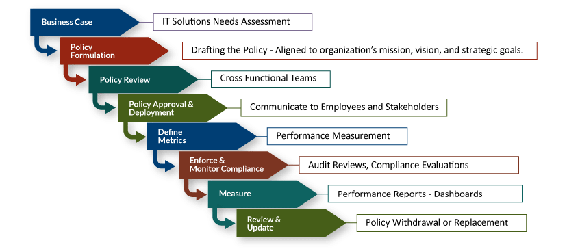

# IT Solution and Design Policies

IT policy is a very important topic within today’s organizations, as cloud and mobile solutions quickly become the heart of IT operations. The lack of sound and complete IT policies can be very costly to an organization. This week, you will explore research in the area of IT policy creation, management, and strategic use.

An IT strategy is a comprehensive, documented plan that outlines how IT will support business activities and processes aligned with business strategy to achieve business goals (Rouse, 2017). Strategic planning involves the creation of a long-term plan to achieve a specific mission and usually encompasses 3 to 5 years in the future. This strategic plan must align with a mission and vision statement.

A mission statement is a short and concise written declaration describing the company and what it does or produces—that is, the core purpose of the organization. The vision statement is also a short and concise statement on where the company envisions itself in the future (e.g., 5 years from now).

A goal is a general statement of the expected outcomes from operations or services. Based on the mission, vision, goals statements, and strategic plans, the IT department builds its IT policies, standards, and procedures—both on paper and in systems configurations, network parameters and rules, database rules, and application coding control provisions. This becomes the foundation for the IT strategic planning lifecycle, depicted in Figure 1:

_Figure 1. Information Technology Strategic Planning Lifecycle_

With the mission, vision, and strategic objectives in place, the right IT solution to support the strategic plan can be presented. Operational or tactical planning is also a part of strategic planning, this time focusing on short-term objectives that must be met to ensure progress and success of the strategic plan. You must clearly understand what to consider as part of a strategic IT implementation for your plan, and what is considered part of operations or tasks. Installing a firewall is a task or activity, not a project or a strategic solution. Migrating to a hybrid cloud infrastructure can be considered a strategic IT implementation.

IT governance is defined as the governing model or framework that sets the rules and policies all employees, users, and stakeholders must observe and abide by for efficient and safe operations. IT governance comprises the integration of tools, processes, policies, and standards that conform to the frameworks for governing the IT Department in support of enterprise operations or service chain. Gartner (2017) defines in its glossary, IT governance as a process of establishing the IT control framework and ensure observance and compliance with them. In order to effectively support the achievement of enterprise goals, the policies, standards, and procedures that are part of the IT governance model must be aligned with the strategic plan.

These policy provisions need to be reflected in operating systems, database, and application parameters for sound systems parameter configuration, processing, and operations compliance. IT professionals, especially system administrators, must identify specific internal policies to be configured as stated by enterprise and IT policies, standards, and procedures, based on the model depicted in Figure 2 below:

_Figure 2. Information Technology Governance Lifecycle_

To effectively develop and deploy a proper IT governance framework at any enterprise or institution, you must first assess and understand an organization’s culture, dynamics, and maturity level. As the IT team assess operational structures and IT landscape, the control structure is applied and deployed in coordination with department unit managers. Input controls—like selection and validation criteria for data input, validation provisions during data processing inserted in code and scripts, and valid formatting for all outputs (for example, the entire social security number must not be displayed in any document or report, only the last 4 digits)—ensure valid data is entered, processed, and stored. By having valid data properly safeguarded, compliance with legal requirements for data protection is ensured.

## References

- Gartner, Inc. (2017). Definition of IT governance.
- Rouse, M. (2012). Definition of IT strategy. SearchCIO- Tech Target.
