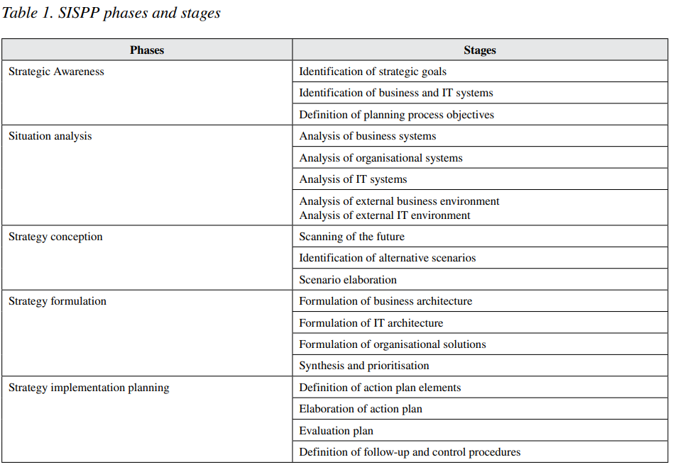
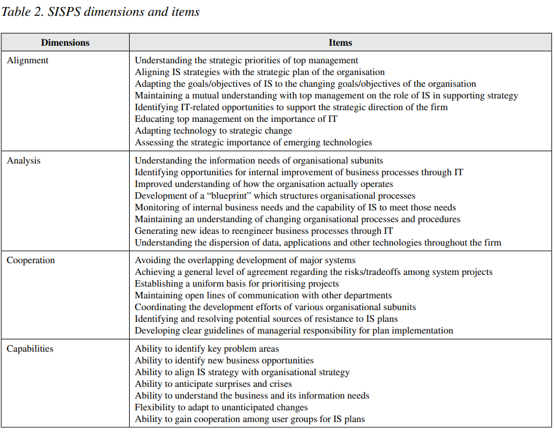
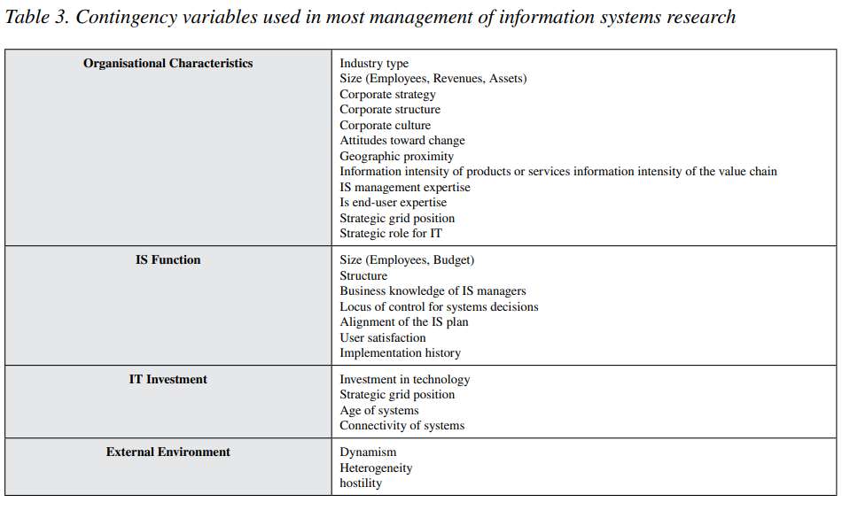
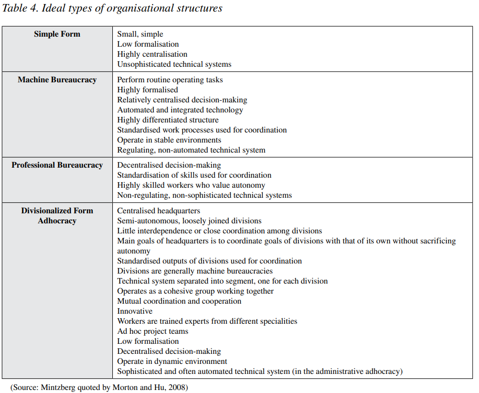
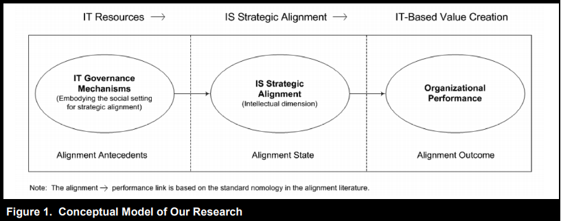

# Readings

## Information technology investment governance (2015)

Ali, S., Green, P., & Robb, A. (2015). Information technology investment governance: What is it and does it matter? INTERNATIONAL JOURNAL OF ACCOUNTING INFORMATION SYSTEMS, 18, 1–25. [doi](https://doi.org/10.1016/j.accinf.2015.04.002). [InvestmentGovernance.pdf](InvestmentGovernance.pdf).

Businesses are making ever more significant investments into technology.  However, those systems do not always produce meaningful, sustainable, or competitive improvements.  These situations waste time and resources, and require governance processes (e.g., steering committees) to ensure the business is aquiring the right capabilities.

> IT investment governance (ITIG) which is a subset of IT governance is mainly concerned with the aspects of value delivery and resource management of IT within organizations (Weill & Ross, 2004; ITGI, 2008). Weill & Ross (2004), note that IT governance encompasses five sub-domains: IT principles; IT architecture; IT infrastructure; business application needs; and value delivery and resource management. [...] Because resource-based theory can explain the source of organizations’ sustained competitive advantage and is widely used in strategic management discipline, it has also been used by IT researchers in multiple research areas of information systems (IS) (Seddon, 2014).

## Arizona Department of Administration Technology (2018)

Arizona Department of Administration Technology. (2018). Information technology policies, standards, and procedures. [https://aset.az.gov/resources/policies-standards-and-procedures](https://aset.az.gov/resources/policies-standards-and-procedures).

## Governance of IT - Benefits of Good IT Governance (2013)

Holt, A. L. (2013). Governance of IT: An executive guide to ISO/IEC 38500. Chapter 6. London, UK: BCS. [ProQuest](https://ebookcentral.proquest.com/lib/ncent-ebooks/detail.action?docID=1213991). [GovernIT_ch6](GovernIT_ch6.pdf).

Organisations working from the 38500 six principles of best practice IT governance, and
using a tried and tested decision-making model to evaluate business cases and to guide
procurement decisions, can expect to see the following benefits:

- cost reduction;
- performance improvement;
- ability to react quickly to market changes;
- increased customer satisfaction;
- more sustainable practices;
- increased revenue per dollar cost;
- general workplace benefits for the board, management and staff.

When you look through the list of bad things that can happen when there is no or
insufficient IT governance in place, you will soon observe that these events would mostly
be linked – for example, a security breach would almost always result in a reputation
loss, and a reputation loss is likely to result in a loss of business. Loss of business will
result in financial loss.

The reason for considering these outcomes separately is to identify the different types
of governance-related root causes that can result in ‘bad things’:

- security breaches;
- financial loss;
- nasty surprises;
- general reputation loss;
- loss of business.

## Strategic IT and organizational politics (2015)

Iyamu, T. (Ed.). (2015). Strategic Information Technology Governance and Organizational Politics in Modern Business. IGI Global. [doi](https://doi.org/10.4018/978-1-4666-8524-6). [IGI Global Publisher](https://www-igi-global-com.proxy1.ncu.edu/gateway/book/124236). [StrategicIT_book](StrategicIT_book.pdf).

Medium sized enterprises adopt technology without considering the broader implications.  This haphazard procurement model creates challenges integrating systems which now span different vendors and IT stacks.  The senior leadership team owns the budget, direction, and IT resource strategy.  However, those leaders are typically focused on running the business versus keeping up with the latest solutions.  Meanwhile, middle management lacks the training and experience to properly vet new patterns and paradymns.  Instead, businesses must define **Strategic Information Systems Planning** policies that align the IT direction with the business plans.

> In the last two decades, much work has been done on organisational politics, as well as on strategic information technology (IT), often separately articulated and presented. Thus, what has been missing is the interaction between strategic IT and organisational politics, making many of the major IT challenges in organisations to remain unresolved. Some of the IT challenges include how networks of both human and non-human actors are formed; how the actors’ interacts; structural diverse; and manifestation of environmental factorsin the development, implementation, management and use of information systems and technologies in the organisations. It is in this area this book focuses upon, for the benefit of both the academic and corporate domains.

### How did they study SISP

The present study included one _independent variable_: Strategic Information Systems Planning Process (SISPP) with five phases namely:

- strategic awareness,
- situation analysis,
- strategy conception,
- strategy formulation,
- and strategy implementation.

One _dependent variable_ was Strategic Information Systems Planning Success (SISPS). The SISPS contain four dimensions, namely:

- alignment,
- analysis,
- cooperation,
- and improvement in capabilities.

One _moderate variable_: environmental uncertainty with three sub-constructs, which are

- environmental dynamism (instability),
- environmental heterogeneity (diversity and complexity)
- and environmental hostility (resource availability).

### What influence comes from organizational structure

> Organisational structure is a `fundamental factor influencing SISP effectiveness and strategic information systems applications` (Wang & Tai, 2003). Organisational structure refers to the framework typically hierarchical within which an organisation arranges its lines of authority and communications, and allocates rights and duties. Organisational structure determines the manner and extent to which roles, power and responsibilities are delegated, controlled and coordinated, and how information flows between levels of management. `A structure depends entirely on the organisation’s objectives and the strategy chosen to achieve them` (Morton & Hu, 2008; Lee & Pai, 2003).
>
>According to Donaldson (2001) organisational structure is `more complicated than distinguishing between centralised and decentralised operations or decisions-making`. Other commonly cited structural dimensions include specialisation, standardisation, formalisation, hierarchical levels and span of control. Taking into account of the number of proposed structural dimensions and the variety of their definitions, `identifying a definitive set of organisational dimensions is difficult without specific context and objectives` (Morton & Hu, 2008).

## What is IT governance (2017)

Lindros, K. (2017, July 31). What is IT governance? A formal way to align IT & business strategy. [cio.com](https://www.cio.com/article/2438931/governanceit-governance-definition-and-solutions.html). [CIO_Governance](CIO_Governance.pdf). [YouTube](https://youtu.be/5U5f17vO1Y0).

The most commonly used frameworks are:

- **COBIT**: Published by ISACA, COBIT is a comprehensive framework of "globally accepted practices, analytical tools and models" (PDF) designed for governance and management of enterprise IT. With its roots in IT auditing, ISACA expanded COBIT's scope over the years to fully support IT governance. The latest version is COBIT 5, which is widely used by organizations focused on risk management and mitigation.

- **ITIL**: Formerly an acronym for Information Technology Infrastructure Library, ITIL focuses on IT service management. It aims to ensure that IT services support core processes of the business. ITIL comprises five sets of management best practices for service strategy, design, transition (such as change management), operation and continual service improvement.

- **COSO**: This model for evaluating internal controls is from the Committee of Sponsoring Organizations of the Treadway Commission (COSO). COSO's focus is less IT-specific than the other frameworks, concentrating more on business aspects like enterprise risk management (ERM) and fraud deterrence.

- **CMMI**: The Capability Maturity Model Integration method, developed by the Software Engineering Institute, is an approach to performance improvement. CMMI uses a scale of 1 to 5 to gauge an organization's performance, quality and profitability maturity level. According to Calatayud, "allowing for mixed mode and objective measurements to be inserted is critical in measuring risks that are qualitative in nature."

- **FAIR**: Factor Analysis of Information Risk (FAIR) is a relatively new model that helps organizations quantify risk. The focus is on cyber security and operational risk, with the goal of making more well-informed decisions. Although it's newer than other frameworks mentioned here, Calatayud points out that it's already gained a lot of traction with Fortune 500 companies.

## How Information Technology Governance Influence Organizations (2015)

Ping-Ju Wu, S., Straub, D. W., & Liang, T.-P. (2015). How Information Technology Governance Mechanisms and Strategic Alignment Influence Organizational Performance: Insights from a Matched Survey of Business and It Managers. MIS Quarterly, 39(2), 497-A7. [InfluencingOrganziations](InfluencingOrganziations.pdf).

The article discusses mechanisms and processes for organizations to gain intellectual and social alignment through IT governance.  `Intellectual alignment` refers to the planning, infrastructure, and implementation.  Meanwhile, `social alignment` comes from a shared understanding across the business.

When leaders define a vision and communicate the value, it enables the business to invest in the _right IT resources_ and produce the maximum organizational value.  Leaders need to be cognizant of the customers and organizational goals, and remember that IT is mearly tools.  Those tools and capabilities do not magically create value, they enable `sustainable underlying processes that create value`.

### How do organizations implement governance

> The relationship between IT governance and strategic alignment was not established until De Haes and Van Grembergen’s (2009) exploratory study of IT governance mechanisms for a better alignment between business and IT. Van Grembergen and De Haes (2012) further indicate that the implementation of processes, structures, and relational mechanisms “enable both business and IT people to execute their responsibilities in support of business/IT alignment and the creation of business value from IT enabled investments” (pp. 2-3).

### What literature review did they preform

> Two main observations emerge from Table 1. First, despite differences in the definition of IT governance, IT governance mechanisms in general consist of structures, processes, and relational
mechanisms to enhance business/IT alignment, and the research upholds positive associations between IT governance mechanisms and IT governance performance.
>
>Second, only the relationships of certain IT governance mechanisms with IT governance performance have been examined. More complete and solid empirical support for the three types of governance mechanisms identified and their relationship with strategic alignment is still missing from the literature

|Study| Research Questions/Purpose| Definition of IT Governance| Research Findings|
|------|--------------------------|----------------------------|------------------|
|Bowen et al.(2007)|To examine the factors that influence IT governance structures, processes, and outcome metrics.|IT governance is “the IT related decision making structure and methodologies implemented to plan, organize, and control IT activities” (p.194).| Effective IT governance is positively associated with a shared understanding of business and IT, active involvement of IT steering committees, a balance of business and IT people for IT decision making, and well-communicated IT strategies and policies.|
De Haes and Van Grembergen (2009)|“(1) How are organizations implementing IT governance?” (p. 123). (2) “What is the relationship between IT governance and business/IT alignment?” (p. 124).| IT governance “consists of the leadership and organizational structures and processes that ensure that the organization’s IT sustains and extends the organization’s strategy and objectives” (p. 123). |There is a positive relationship between the use of IT governance practices and business/IT alignment. Highly aligned organizations leverage more mature IT governance practices.
Huang et al. (2010)| To better understand the nature of effective IT steering committees.| The goal of IT governance is “to direct and oversee an organization’s IT-related decisions and actions such that desired behaviors and outcomes are realized” (p. 289). |IT steering committees comprised of executive-level participants adopted a broader, longer-term orientation. The SMEs with broadly-disseminated and easily-accessed IT governance policies had greater success in IT use|
Prasad et al. (2010)| “To obtain a deeper understanding of the effectiveness of firm’s IT governance initiatives” (p. 215).| “IT governance specifies the decision rights and accountability framework to encourage desirable behavior in the use of IT (Weill and Ross 2004). It also includes the foundational mechanisms in the form of the leadership, and organizational structures and processes that ensure that the organization’s IT sustains and extends the organization’s strategies and objectives” (p. 216).| IT steering committee is positively related to the level of IT-related capabilities.
Ali and Green (2012)| “What individual IT governance mechanisms impact significantly a higher perceived level of overall effective IT governance?” (p. 180).| “A structure of relationships and processes to control the enterprise in order to achieve the enterprise’s goals by adding value while balancing risk versus return over IT and its processes” (p. 180). |The existence of governance mechanisms such as: (1) a culture of compliance in IT; (2) corporate communication systems support; (3) involvement of senior management on a regular basis; and (4) a corporate performance measurement system significantly impact the level of effective IT governance.
Bradley et al. (2012) |“(1) What are some of the antecedent factors to IT governance in hospitals? (2) What are some of the important consequent variables that are affected by IT governance in hospitals?” (p. 157).| IT governance is “the capacity of top management to control the formulation and implementation of the IT strategy via organizational structures and processes that produce desirable behaviors, which will ensure that IT initiatives sustain and extend the organization’s strategy and objectives” (p. 157).| Structural and relational mechanisms such as CIO structural power, ITbusiness mutual participation, and an entrepreneurial culture on IT governance can positively affect IT governance and indirectly, IT value creation.
Chong and Tan (2012) |“(1) How do collaborative networks establish effective IT governance? (2) What sociotechnical factors are essential to the effectiveness of IT Governance in a collaborative network? How do these factors influence IT Governance structures, processes and relational mechanisms?” (p. 36).| IT governance is regarded as “a framework in specifying the allocation of IT related decision making rights and responsibilities to the right organizational group and deploying relational mechanisms to support the alignment between business objectives and IT” (p.34).| Socio-technical factors such as an active involvement of a governing body, a coordinated communication process and the presence of relational culture and attitudinal commitment are essential to the effectiveness of IT governance in a collaborative network.
Herz et al. (2012)| “(1) What are relevant IT governance mechanisms based on the current body of knowledge? (2) Which mechanisms could a multisourcing Governance framework in a business group encompass?” (p. 5033). |IT governance is “integral part of corporate governance”, which “addresses the definition and implementation of processes, structures and relational mechanisms in the organization that enable both business and IT people to execute their responsibilities in support of business/ IT alignment and the creation of business value from IT-enabled business investments” (p. 5036). |Multisourcing governance mechanisms in a business group were determined to be either company-internal mechanisms or supplier-related mechanisms. Structures, processes and relational mechanism can be configured to match different relationships of multisourcing between the business groups.
Prasad et al. (2012)| “(1) What are the effective IT governance structures for collaborative organizational structures? (2) How do we evaluate the effectiveness of these IT governance structures?” (p. 200).| “IT governance essentially places structure around how organizations IT strategy aligns with business strategy. This IT-business alignment will ensure that organizations continue to achieve their strategies and goals, and implementing ways to evaluate its performance” (p. 201).| Organizational IT governance structures provide the platform for better understanding and effective use of the newly acquired IT resources.
