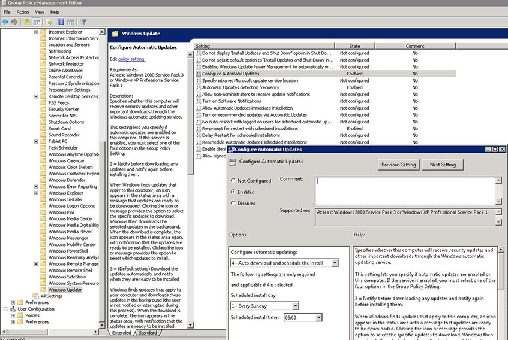
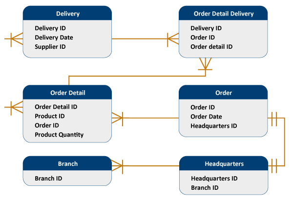

# Requirements and Impact Assessment

A business needs statement briefly describes the events, criteria, or specific business or operations; this provides all the necessary information to justify the need for the project. The assessment, or requirements assessment, is used to authorize project start (green-light) and get the approvals and funding needed for the software solution development, upgrade, or network implementation. All these processes must follow a structure and format, and these criteria must be reflected in all standard operating procedures (SOPs) and policies.

In order to design realistic and achievable IT policies, standards, and procedures, it is important to determine if the infrastructure components align with business needs. A business needs assessment will accomplish this task and provide you with an opportunity to identify any gaps in the current systems and application’s configurations.

The first step in creating a technology strategic or implementation plan is to perform an assessment of current applications and systems running at the enterprise, contrasted with operating needs. IT officers must understand the nature of the enterprise or institution, its locations, its organizational structure, and its processes to determine the control needs to improve and secure the operations or service chain.

The purpose of this assessment is to identify the needs of departments or operational units to make sure the control structure to be deployed and stated in policies and standards is realistic and attainable. In the case of computer science, when we talk about policies and standards, we are referring to the internal rules, parameters, and system configurations for data integrity, availability, smooth database and application performance, and asset security. Policies are configured at the network, operating system, database, application, and storage layers. This course will focus on internal system policies implementation, aligned with written policies, standards, and procedures. From the systems security standpoint, user access policies and profiles are critical for data and application protection, and segregation of duties principle. A sample screen of the system policies suite in Windows operating system, active directory is shown in Figure 3, and an entity-relationship diagram (ERD) is shown in Figure 4 below:

_Figure 3. Sample image of a Windows Active Directory group policy configuration screen._

_Figure 4. Sample of Entity Relationship Diagram._

Based on operational needs, an assessment of the current technology infrastructure (network and telecommunications), data landscape, and applications completes the overall IT strategic assessment. The tools to use as a starting point for your planning can be organizational structure diagrams, the organization’s strategic plans, and playbooks, or any other strategic document.

A complete strategic IT plan usually encompasses a period of 3 to 5 years into the future. The strategic plan is a method for the CIO (chief information officer), CISO (chief information security officer), and NOC (network operations center) manager to provide insight into where the business currently is, where it needs to be, how it will get there, and how everyone will know if it is successful. With this information in hand, technology forecasts in terms of hardware, software, and IT services are needed to support strategic goals and operations.

With the mission, vision, and strategic objectives in place, the right IT policies to support the strategic plans with application development and network enhancements can be presented. The system, database, and security administrators must make sure all systems, database, and application policies, parameters, and rules are set up, configured, or coded—all aligned with the written policies, standards, and procedures to ensure compliance.

One tool or diagram to have in hand when performing the initial assessment for policy development or update is the network conceptual and physical diagrams. Applications and data repositories must also be known for policy and data and coding standards accuracy. These tools are essential for network and infrastructure management; and they are among the documents and artifacts requested before an audit and for insurance purposes in case of a serious incident such as a fire, earthquake, tornado, or catastrophic events.

In the case of software development and implementation, as-is analysis, and to-be specifications in the design are critical. As is means the current state of operations, databases, and applications; and to be is the proposed enhanced or new solutions with control requirements. There are constraints to develop a sound, realistic, and precise work plan with a balanced resource schedule—which is why developing a realistic schedule with a balanced workload distribution is important, especially when working with an agile project management approach. These considerations must be contemplated in policies like application development standards, project management guidelines, application, and data security standards, among others.

Be sure to review this week's resources carefully. You are expected to apply the information from these resources when you prepare your assignments.
