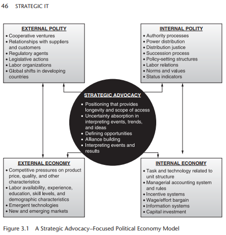

# Readings

## Implementing world class IT (2014)

High, P. A., & Passerini, F. (2014). Implementing world class IT strategy : how IT can drive organizational innovation. Jossey-Bass. [O'Reilly](https://learning.oreilly.com/library/view/implementing-world-class/9781118634110/). [WorldClass_IT_ch3.docx](WorldClass_IT_ch3.docx).

The authors recant learning from Google's CIO and his approach to IT investments.

### Why generic increase sales goals are bad

> Jerry’s new firm suffered from a common ailment among fast-growing companies that have not reached anywhere near saturation in their markets: their number one objective is to “increase sales.” Sales targets might be better defined as, “Increase by 25 percent in the next fiscal year,” but if those targets aren’t qualified further, their suggestion is that any new revenue is good revenue. What the target doesn’t say is, for example,

1. _What’s the targeted profitability of the new revenue_? Do we go after revenue growth that might deteriorate the current rate of profitability?

2. _Should revenue growth derive from existing products and services or from new products and services_? People in general, especially sales teams, have a tendency to revert to pushing what they know versus what they do not, and so without clear guidance, the tendency will be to continue to push existing products and services.

3. _Should revenue growth come through existing channels, customers, or geographies, as opposed to revenue from new channels, customers, or geographies_? Again, what is known is likely to be pushed more than the new and unknown, so it’s important to declare where new channels should be leveraged, which new customers to target, and which new geographies to enter.

4. _Should revenue growth be organic, or can we grow it by acquiring another company_? Each of these is a noble way to grow revenue, and some companies are better suited to acquiring companies than others. Nevertheless, we need to know how these factors should be taken into consideration.

### Why can't projects drive strategy

Jerry is bold—not a status quo leader. As he asked his colleagues in IT simple questions about how IT had generated the list of projects it was working on, and how the projects were prioritized, the answers he got were unclear. The typical response went something like this: “One of the functional heads spoke with the CIO [Jerry’s predecessor] about the latest critical project that needed to be given top priority. At the time, we were working on what the same executive had indicated earlier was the most crucial project, but that didn’t seem to matter.”

These kinds of seemingly arbitrary turnabouts were commonplace, and there was no strategy in place to refocus the conversation. Priorities should change at times, of course, in the face of factors such as:

- Changes in the economic outlook
- Changes forged by a competitor that require a response
- A natural disaster having an impact on a part of the operation
- Legal action against the company
- The failure or success of a product or service launch
- The departure of a leader
- Identification of new market opportunities that are underserved by competitors
- Revelation of new data or prototypes that necessitate a pivot
- The acquisition or divestiture of a business

Changes in priorities should drive changes in projects, not the other way around. In reality, often project ideas are allowed to trump strategy, and the opinions of a single, powerful executive trump the logic of the strategic plan.

## Technology-Focused Planning (2016)

Hyungu Kang. (2016). Technology-Focused Strategic Planning In Service Businesses. Franklin Business & Law Journal, 2016(1), 8–19. [EBSO](https://search.ebscohost.com/login.aspx?direct=true&AuthType=ip,sso&db=bth&AN=112407344&site=eds-live). [TechFocusedPlanning.pdf](TechFocusedPlanning.pdf).

The author discuss the need for businesses to invest in technology, while balancing the business drivers.  For instance, if the organization never upgrades its systems they will eventually become uncompetitive.  However, not all systems require the same investment cadence.

Perhaps the video editing department requires PC-refresh every 36 months, but the same isn't true for the administrative assistant. The critical distinction comes from the incremental value increase from making the investment.  For the VFX department, reducing rendering times means those staff ($$$/hr) can work on different tasks.  Meanwhile, the assistant only uses a fraction of the current resources and gains minimal improvements.

### How should we approach IT-focused projects

> Technology as a source of building competitive advantage is playing an important role in many service firms [8]. To use technology for competitive advantage, companies must be explicit about the role of technology in their strategies. Being explicit requires answers to four basic questions.

1. **What is the basis of competition?** It must be clear whether technology is the critical determinant or just one of several important factors for success.

2. **What technologies must you master to compete?** Critical product, process, applications, and systems technologies must be identified.

3. **How competitive are you in these technologies?** Here’s where good competitive intelligence and benchmarking pay dividends.

4. **What is your technology strategy?** A company must choose to be a pioneer, a fast follower, form an alliance or partnership, or a combination of the above [9]. Once technology’s role is made explicit, then it is much easier to improve how technology is used, resourced and managed to achieve desired strategic objectives.

## Strategic IT (2013)

Langer, A. M., & Yorks, L. (2013). Strategic IT. [electronic resource] : best practices for managers and executives. Wiley. [ProQuest](https://ebookcentral.proquest.com/lib/ncent-ebooks/detail.action?docID=1158348#). [StrategicIT_ch3](StrategicIT_ch3.pdf).

This chapter discusses the role of Chief Information Officiers. "_I would always start the conversation in terms of what is the meaning for the business. They are never IT conversations or IT projects; they are always business enabler projects_."

The authors continue with a description of the `Strategic Advocacy Mindset`; _by strategic advocacy we mean adding value to either the top or bottom line by cultivating alliances and establishing personal and functional influence through helping to define and respond to the adaptive and generative challenges that confront the organization and the possibilities they provide. Adaptive challenges are created by extensions and new applications of existing technologies and practices_.

### What is the Political Economy Model

When leaders do not approach problems from the business perspective, it becomes challenging to overcome political resistance and ensure resources flow to the most appropriate outcomes.  However, those advocates must function within the **Political Economy Model**.

Two analytical tools that are central to the literature on strategic planning that structure and formalize thinking about the political economy of an organization are:

1. `PEST Analysis`: **P**olitical factors, **E**conomic factors, **S**ocial factors, and **T**echnological factors.
2. `SWOT Analysis`: Organization’s **S**trengths, **W**eaknesses, **O**pportunities, and **T**hreats in the external environment.

## Managing IT projects (2013)

Morgan, J. (Project manager), & Dale, C. (2013). Managing IT projects for business change : from risk to success. BCS, The Chartered Institute for IT. [EBSCO](https://search.ebscohost.com/login.aspx?direct=true&AuthType=ip,sso&db=cat01034a&AN=nu.EBC1213993&site=eds-live). [O'Reilly](https://learning.oreilly.com/library/view/managing-it-projects/9781780171609/). [ManageIT_Projects_ch6.docx](ManageIT_Projects_ch6.docx).

This chapter discusses the criticality of planning business projects.  While the project rarely will follow the plan it is still essential to have an outline.  Program managers must also be adaptive since anything beyond 6-months is an unrealistic goal.

The plan drives the project, so it should:

- explain, in business terms, the result(s) the project is expected to achieve and, in summary, how it is going to achieve it;
- explain the objectives of the project and help people identify with them;
- imbue a sense of realism and of confidence that the team can do it;
- help you identify and eliminate tasks that do not contribute to achieving the objectives;
- identify what might get in the way – risks, for example;
- not give a sense that the plan is ‘all or nothing’, instead show that the team is ready to respond to changes;
- get the team off to a fast start.

## Phases of the project plan

