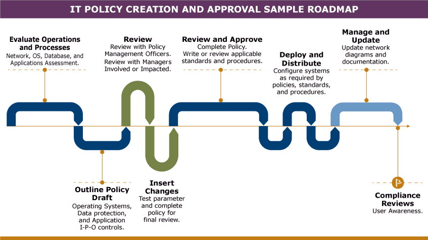

# Policy Strategy Schedule

Working with policies and SOPs is a cross-functional team effort. IT professionals do not design, approve, and implement these documents or configure them in the systems by themselves. It is because of this collaborative effort that a roadmap or development standard table or procedure is paramount. In here, all actors involved in the process are properly identified, along with in which part of the process do they intervene, for how long, and the expected outcome of their intervention or collaboration.

As a result of the needs assessment, the proposal for the IT solution implementation—with all applicable systems parameters, tools, and rules—can be improved by incorporating new elements or data to support the planning process of the project. Based on these assumptions, policies and standards can be outlined; or current policies can be reviewed and updated to reflect the current state of operations and IT landscape.

With the inclusion of technologies like mobile computing, social media use, and cloud computing, it has become critical for organizations to have clear procedures for policy design and management. Policies are never final, especially IT policies since they will likely require modifications and updates to reflect current configurations and applications, plus observe law compliance requirements. There should be a history of policy versioning, both on paper and in system parameters, as part of corporate knowledge management and for compliance audits.

Depending on the size and nature of the organization, management can designate employees or even an office to be in charge of managing policy formatting procedures; reviewing and editing all policies, standards, and procedures before sending to executive management for approval; and keeping a log of all versions and tracking all changes. The IT department must then interact with this team/department whenever updating IT or security policies to ensure that not only are they following corporate standards but they also ensure all configuration and controls requirements are possible and realistic. Standards for policy naming, writing format, and structure, the flow of review, approval, and deployment must be designed and approved by executive management and then communicated to senior management and departments who develop and manage policy.

Department officers responsible for IT policy formulation, evaluation, and management must design and manage their roadmap for policy creation and have a standard policy and procedure describing the format for writing and configuring IT policies, standards, and procedures. These officers are responsible for submitting final policies for executive management evaluation and approval, as illustrated in the sample roadmap shown below:

_Figure 5. IT Policy, Creation, and Management Procedure Roadmap._

Review the resources listed below (and previously provided resources, as needed) to prepare for this week’s assignments. The resources may include textbook reading assignments, journal articles, websites, links to tools or software, videos, handouts, rubrics, etc.
