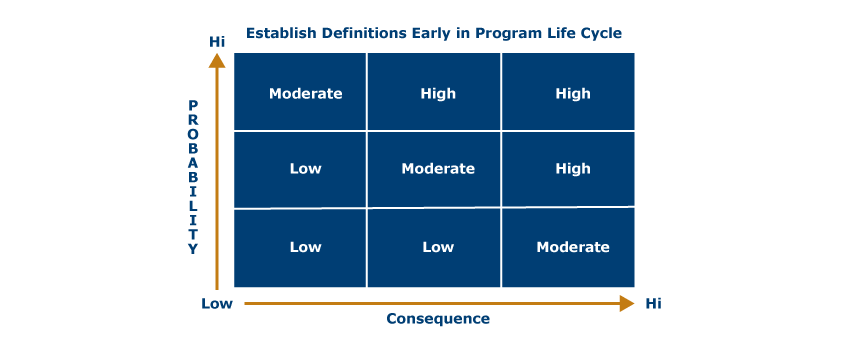
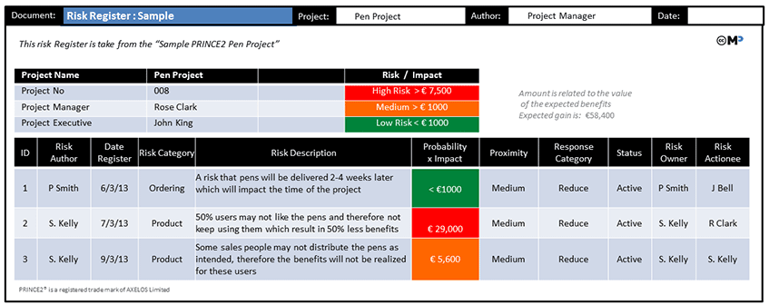

# Create an IT Policy Management Framework to Mitigate Risk

For this week, you must use the IT policy control framework developed in the previous assignment to add a risk assessment to your IT solution strategic plan.  Once your risk reduction and control strategy are in place, provisions are to be made in system policies for quality assurance and management program.

## Categorize potential vulnerabilities

Begin by categorizing potential vulnerabilities and risks that must be addressed by policies, standards, and procedures based on the risk matrix for your organization (if available) or created by you similar to the example in Figure 6.

Figure 6. Sample Risk Matrix. US gov [Public domain](https://upload.wikimedia.org/wikipedia/commons/b/b4/Risk_Matrix_Simple.jpg)

## Approach

1. Plan to include the potential vulnerabilities and risks table as part of the introduction in your IT solution strategic plan.
2. Address provisions and processes for risk assessment and evaluation (at the network, operating system, data, and software layer).
3. You could use spreadsheet software to configure the matrix and levels of categorization for all layers:
  a. network infrastructure risk criteria and tolerance levels
  b. operating systems
  c. database and application risk criteria for risk assessment and management.
4. Based on your scenario, identify and develop a risk register (sample is shown below), where you will identify potential risks and their severity level; then, present and discuss corrective measures to be taken by inserting provisions in policies, standards, and standard operating procedure.

Figure 7. Sample Risk Register. Retrieved from [Prince2.wiki](https://prince2.wiki/management-products/risk-register/)

## Mitigate

1. Create an outline that describes the main policies and standards to be developed. Do not write the entire policy, create only an outline of the content each policy must have, specifically related to IT controls.
2. For each policy, outline the main control provisions based on your assessment and your risk categorization.
3. Include the risk matrix and risk register in your document, aligned with the network and applications to be assessed and controlled. You will submit 3 files, the paper, the risk matrix, and risk register.

## Requirements

Length: 7-9 pages, including title and reference pages

References: Include a minimum of 5 scholarly resources.

The completed assignment should demonstrate thoughtful consideration of the ideas and concepts presented in the course by providing new thoughts and insights relating directly to this topic. The content should reflect scholarly writing and current APA standards and should adhere to Northcentral University's Academic Integrity Policy.

Upload your documents (risk matrix, risk register, and policies control outline document), and click the Submit to Dropbox button.
