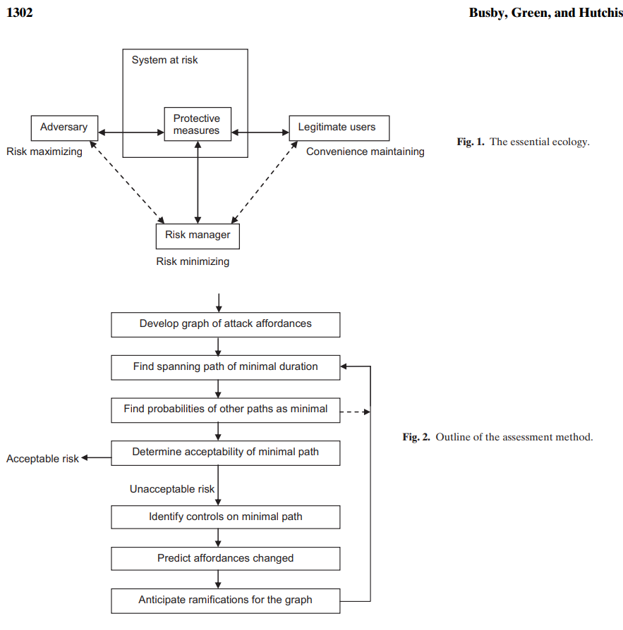

# Readings

## Assessment of Industrial Control Cybersecurity Risk (2017)

Busby JS, Green B, Hutchison D. Analysis of Affordance, Time, and Adaptation in the Assessment of Industrial Control System Cybersecurity Risk. Risk Analysis: An International Journal. 2017;37(7):1298-1314. Accessed September 26, 2021. [EBSCO](https://search.ebscohost.com/login.aspx?direct=true&db=s3h&AN=124333378&authtype=sso&custid=s1229530&site=eds-live&scope=site). [IndustrialControl.pdf](IndustrialControl.pdf).

The authors propose an algorithm for assessing risk with graph theory.  Nodes represent the various system components and weighted edges specify both a connection and complexity factor.  After declaring the graph, they run Markov Chain models to simulate different compromise scenarios.

There is also specific attention to SCADA controls, which manage many critical infrastructures (e.g., water treatment plans).  Its well documented that those technologies are vulnerable to attack and missing many modern security protections.

## Cyber Risk from CRO perspective (2018)

Grobler, Jaco. 2018. “Cyber Risk from a Chief Risk Officer Perspective.” Journal of Risk Management in Financial Institutions 11 (2): 125–31. [EBSCO](https://search.ebscohost.com/login.aspx?direct=true&db=bth&AN=128885445&authtype=sso&custid=s1229530&site=eds-live&scope=site). [CyberRiskOfficer.pdf](CyberRiskOfficer.pdf).

The author discusses the distinction between operational risk and cyber risk.  While traditional risk management is a well-understood domain, cyber risk continues to evolve in challenging ways.

Common Myths Include:

- Core systems are secure and cannot be compromised
- Policies and frameworks are the starting point
- Traditional matrix approach focusing on materiality is the best starting point
- Firewall and perimeter security is the key defence
- Cyber risk is territory focused
- You can utilise your existing risk management skills to deal with cyber risk
- You can migate cyber risk with insurance
- Data are safe because you have encryption
- Adopting a leading cyber standard is adequate
- Cyber risk should be dealt with by CIOs

## Integrated Cyberrisk Management (2015)

Kosub T. (2015) Components and challenges of integrated cyber risk management. Zeitschrift für die gesamte Versicherungswissenschaft. 2015;104(5):615-634. Accessed September 26, 2021. [EBSCO](https://search.ebscohost.com/login.aspx?direct=true&db=edb&AN=110952142&authtype=sso&custid=s1229530&site=eds-live&scope=site). [IntegratedCyberRiskMgmt.pdf](IntegratedCyberRiskMgmt.pdf).

This paper provides a summary review of [TIM-8301 Principals of CyberSecurity](https://github.com/dr-natetorious/TIM-8301-Principals_of_CyberSecurity). It discusses terminalogy and distinctions between concepts like cyber risk and cyber management. Additional notes on this paper are available in [TIM-7030 Managing Risk Week2](https://github.com/dr-natetorious/TIM-7030-Managing_Risks_and_Privacy/blob/master/Week2_RiskManagement/Readings/Notes.md).

Kosub proposes that risk management should contain the following components:

1. Risk identification
2. Risk assessment and valuation
3. Risk response (e.g., avoidance versus reduction)
4. Risk controls (e.g., monitoring and review)
5. Risk culture and governance

## Taxonomy for Managing Cyberstalking (2017)

Tokunaga, R. S., & Aune, K. S. (2017). Cyber-Defense: A Taxonomy of Tactics for Managing Cyberstalking. Journal of Interpersonal Violence, 32(10), 1451–1475. [doi](https://doi.org/10.1177/0886260515589564). [TaxonomyManageStalking](TaxonomyManageStalking.pdf).
