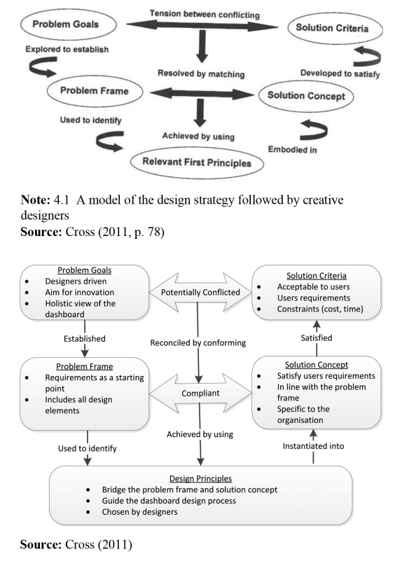

# Readings

## Artifacts of a Project Launch (2017)

BONNAL, P., & RAUSER, C. (2017). CHARTERS, MANDATES, ROADMAPS and Other Artefacts at the Launch of a Project: Characteristics and Similarities. Journal of Modern Project Management, 22–31. [EBSCO](https://search.ebscohost.com/login.aspx?direct=true&db=bth&AN=125356356&authtype=sso&custid=s1229530&site=eds-live&scope=site). [LaunchArtifacts.pdf](LaunchArtifacts.pdf).

Evolving a project from concept to reality requires `documents that unify communication across teams`.  Only the smallest teams can agree on a consistent set of verbal terms and standards.  Meanwhile, most projects span different teams, role families, and even organizations (e.g., vendors and partners).  Creating this broad organizational cohesion requires **charters, mandates, and roadmaps**.  These documents establish both the direction and guardrails that are _universally agreed upon_.

## Modern Quality Assurance System (2019)

BOTEZATU, M. A., PIRNAU, C., & CARP CIOCARDIA, R. M. (2019). A Modern Quality Assurance System - Condition and Support to an Efficient Management. TEM Journal, 8(1), 125–131. [doi](https://doi.org/10.18421/TEM81-18). [ModernQualityAssurance](ModernQualityAssurance.pdf).

## Reflecting design thinking (2015)

Cahyadi, A., & Prananto, A. (2015). Reflecting design thinking: A case study of the process of designing dashboards. Journal of Systems and Information Technology, 17(3), 286-306. [doi](http://dx.doi.org.proxy1.ncu.edu/10.1108/JSIT-03-2015-0018). [DesignThinking.pdf](DesignThinking.pdf).

The authors describe a case study that examines designing useful **performance dashboarding**.  A performance dashboards _are created through a series of analyses of the data and used to represent key metrics that matter for the decision makers (Howson, 2008). These key metrics may be influential in the decision-making activities of the organisation; hence, arguably, an appropriate design of the dashboard is pivotal._ (pg 287).

### How did dashboarding begin

During the literature review, the article describes the history of dashboarding.  It started in the 1980s with _Executive Information Systems_ and eventually shifted into general analytics that visualizing KPIs.

### What is the influence of design thinking

> Design thinking refers to “the cognitive processes that are manifested in design action” (Cross et al., 1992). Similarly Boland and Collopy (2004) observe that thinking is not something that happens solely inside our head, but is generally done with interactions with other people and with the help of tools. (p290)

_Idea generation_ requires a methodical process that _balances analysis and intuition_.  Through _empathy and collaboration_ inventors can make the right design for the right problem.  Afterall, if we do not understand the customers/users, how will we provide the right solution to fit their needs.

### How do I make an effective dashboard

> In UniOne, when designing a dashboard, it is important that the purpose is in line with the University’s strategic plans, visions and missions. Those strategic plans were strongly influenced by employees’ job descriptions and responsibilities across different divisions and hierarchies at UniOne. Aligning the dashboard design with UniOne’s strategic plans makes it easier to reach out to different levels of users in the University, as everyone could relate to their day-to-day tasks

## Project Management Toolbox (2016)

Martinelli, Russ J., and Dragan Z. Milosevic. Project Management ToolBox: Tools and Techniques for the Practicing Project Manager, John Wiley & Sons, Incorporated, 2016. ProQuest Ebook Central, [EBSCO](https://search.ebscohost.com/login.aspx?direct=true&db=cat01034a&AN=nu.EBC4322633&authtype=sso&custid=s1229530&site=eds-live&scope=site). [ProQuest](https://ebookcentral.proquest.com/lib/ncent-ebooks/detail.action?docID=4322633#). [PerformanceReporting.pdf](PerformanceReporting.pdf).
