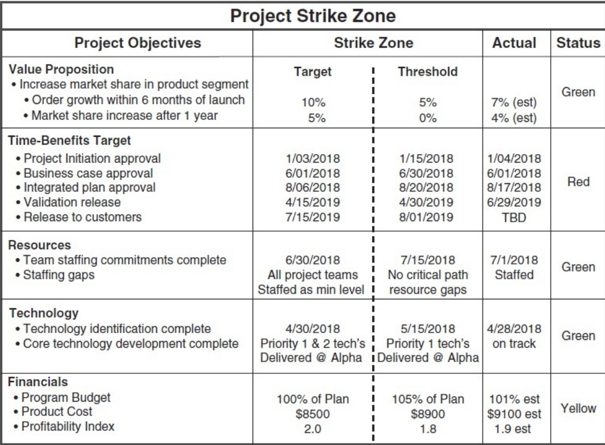

# Readings

## Artifacts of a Project Launch (2017)

BONNAL, P., & RAUSER, C. (2017). CHARTERS, MANDATES, ROADMAPS and Other Artefacts at the Launch of a Project: Characteristics and Similarities. Journal of Modern Project Management, 22–31. [EBSCO](https://search.ebscohost.com/login.aspx?direct=true&db=bth&AN=125356356&authtype=sso&custid=s1229530&site=eds-live&scope=site). [LaunchArtifacts.pdf](LaunchArtifacts.pdf).

Evolving a project from concept to reality requires `documents that unify communication across teams`.  Only the smallest teams can agree on a consistent set of verbal terms and standards.  Meanwhile, most projects span different teams, role families, and even organizations (e.g., vendors and partners).  Creating this broad organizational cohesion requires **charters, mandates, and roadmaps**.  These documents establish both the direction and guardrails that are _universally agreed upon_.  

The authors state its important to treat these documents as `partnership agreements versus strict contracts`, as this perspective encourages collaboration and understand.  Each business unit and organization has its own values and standards.  When peer teams respect those decisions it creates a more hospitable relationship, and those agreements should also focus on critical aspects of the **Statement of Work**.

> While the project charter will be more prolix on the “how”, business case and statement of work should focus on the stakeholder’s needs and describe the outcomes the project will have to produce, in other words the
“what”. The project charter as prescribed by the PMBoK, and although it focuses on “how” rather than “what” remains a strategic document: while specifying the means available to the project manager and their team, it
confirms the direction to be taken and specifies the course (or successive milestones) to be held. The PMBoK recommends that this document be validated by a person external to the project team, typically a project sponsor, a PMO manager or a programme manager. (pg. 24)

### What is PRINCE2

From a deontic point of view, PRINCE2 relies on six aspects (not the only three traditional ones of the famous Barnes’ triptych, quoted by Weaver [13]), namely costs, delays, quality, perimeter, risks and
profits. Surprising as it may seem, the typical content of a project presentation does not include all six aspects that contribute to the relevance of this methodology in a structured way.

It will not have escaped anyone that the methodology PRINCE2 in its principles is not lean! It requires the production of numerous management documents, the contents of which overlap, and it is not always easy to recognize this. It follows that to cover the perimeter of the standard contents of the project charter of the PMBoK and project mandate of HERMES it is necessary to take information in several documents which have at a given moment neither the same levels of maturity nor the same validation chain.

## Modern Quality Assurance System (2019)

BOTEZATU, M. A., PIRNAU, C., & CARP CIOCARDIA, R. M. (2019). A Modern Quality Assurance System - Condition and Support to an Efficient Management. TEM Journal, 8(1), 125–131. [doi](https://doi.org/10.18421/TEM81-18). [ModernQualityAssurance](ModernQualityAssurance.pdf).

In general, in most management branches, there are seven main quality management functions, as follows:

- **quality planning** is the set of processes that contribute to the determination of the company's main objectives in terms of quality, as well as the resources and means to achieve them. Quality planning includes activities setting out quality objectives and quality requirements as well as requirements related to the quality system elements implementation. The objectives and undertaken actions can be set: at Strategic level, by formulating the basic principles and general guidelines of the enterprise in the quality field; at Operative Level, by implementing these principles and guidelines;
- **activities organization** is the effect of all the activities carried out at the organizational level in order to achieve the objectives set by the quality management;
- **activities coordination** represents all the processes that ensure the harmonization of the decisions and actions of the enterprise and its subsystems in order to achieve the organizational objectives. Ensuring an effective coordination is largely influenced by the existence of adequate communication;
- **staff training** refers to all the processes by which the organization staff is attracted to participate in the achievement of the planned quality objectives, taking into account the motivational factors.
- **quality controlling** represents all the activities of process performance supervising and quality outcomes assessing in each of the product trajectory stages in relation to pre-established objectives and standards in order to eliminate deficiencies and prevent their emergence in subsequent processes.
- **quality assurance** is made up of all preventive activities, which systematically seek to ensure the correctness and effectiveness of planning, organization, coordination, training and control activities in order to guarantee the achievement of the desired qualitative level. Another definition is that "quality assurance is the set of pre-established and systematic activities carried out within the quality system and demonstrated as much as necessary in order to give proper confidence that an entity will meet the quality requirements."
- **continuous quality improvement** consists of the activities carried out in each of the stages of the product trajectory in order to improve the performance of all processes and their results, in order to better meet the needs of the customers, with maximum efficiency. The outcome of improvement activities is therefore to achieve a higher level of quality than the one planned by standards or specifications. Achieving such a desideratum is conditioned by the proper performance of the other functions. In terms of quality, the word "action" is an attempt to stop the causes of nonconformities, and can be considered synonymous with "improvement."

## Reflecting design thinking (2015)

Cahyadi, A., & Prananto, A. (2015). Reflecting design thinking: A case study of the process of designing dashboards. Journal of Systems and Information Technology, 17(3), 286-306. [doi](http://dx.doi.org.proxy1.ncu.edu/10.1108/JSIT-03-2015-0018). [DesignThinking.pdf](DesignThinking.pdf).

The authors describe a case study that examines designing useful **performance dashboarding**.  A performance dashboards _are created through a series of analyses of the data and used to represent key metrics that matter for the decision makers (Howson, 2008). These key metrics may be influential in the decision-making activities of the organisation; hence, arguably, an appropriate design of the dashboard is pivotal._ (pg 287).

### How did dashboarding begin

During the literature review, the article describes the history of dashboarding.  It started in the 1980s with _Executive Information Systems_ and eventually shifted into general analytics that visualizing KPIs.

### What is the influence of design thinking

> Design thinking refers to “the cognitive processes that are manifested in design action” (Cross et al., 1992). Similarly Boland and Collopy (2004) observe that thinking is not something that happens solely inside our head, but is generally done with interactions with other people and with the help of tools. (p290)

_Idea generation_ requires a methodical process that _balances analysis and intuition_.  Through _empathy and collaboration_ inventors can make the right design for the right problem.  Afterall, if we do not understand the customers/users, how will we provide the right solution to fit their needs.

### How do I make an effective dashboard

> In UniOne, when designing a dashboard, it is important that the purpose is in line with the University’s strategic plans, visions and missions. Those strategic plans were strongly influenced by employees’ job descriptions and responsibilities across different divisions and hierarchies at UniOne. Aligning the dashboard design with UniOne’s strategic plans makes it easier to reach out to different levels of users in the University, as everyone could relate to their day-to-day tasks

## Project Management Toolbox (2016)

Martinelli, Russ J., and Dragan Z. Milosevic. Project Management ToolBox: Tools and Techniques for the Practicing Project Manager, John Wiley & Sons, Incorporated, 2016. ProQuest Ebook Central, [EBSCO](https://search.ebscohost.com/login.aspx?direct=true&db=cat01034a&AN=nu.EBC4322633&authtype=sso&custid=s1229530&site=eds-live&scope=site). [ProQuest](https://ebookcentral.proquest.com/lib/ncent-ebooks/detail.action?docID=4322633#). [PerformanceReporting.pdf](PerformanceReporting.pdf).

> To be effective, a project status report must be current, concise, accurate, and contain only the information needed to keep stakeholders abreast of progress and the resources used to accomplish the project's objectives. The project reporting checklist will be different for every organization because every organization has its own unique set of information required for project reporting. Developing a standard set of checklist items is good practice, as it drives consistency in project reporting format and content within an organization.

- Project Scope
  - Have the project objectives been changed?
  - Have the deliverables in the project plan changed?
  - Have there been any changes to the project scope?
  - Are there any scope changes awaiting approval?
- Project Schedule
  - Has the schedule been updated?
  - Is the project progressing on the critical path or critical chain?
  - Does the time expended to date vary from the project plan?
  - Do we have adequate resources to maintain the schedule?
  - Are project subcontractors or partners on schedule?
  - What is the estimated completion date?
- Project Budget
  - Has the budget been updated?
  - Is the available budget to date in alignment with the project plan?
  - What is the average monthly budget burn rate?
- Project Performance
  - Have all deliverables been met to date?
  - Have all project milestones been met to date?
  - What is the earned value (EV)?
  - What is the schedule variance (SV)?
  - What is the schedule index (SI)?
  - What is the cost variance (CV)?
  - What is the cost index (CI)?
-Issues
  - Are there any current issues that need to be reported?
  - What are the resolution plans for any open issues?
  - Do our subcontractors or partners have any current issues?
  - Do any issues require project sponsor or top management action?
- Risks
  - What are the HIGH-level risks?
  - What are the risk response plans for all HIGH-level risks?
  - What is the overall risk profile of the project?
  - Do any risks require project sponsor or top management action?
- General
  - Is the project being impacted by any external factors?
  - Are there any quality issues associated with the project outcomes?
  - Are we receiving payments as planned?
  - Are there any actions or decisions needed on the part of the project sponsor or top management?

### What are Project Strike Zones

Bill Shaley, a senior project manager for a leading telecom company, described the culture within his company this way: “Managing a project in this company is like having a rocket strapped to your back with roller skates on your feet—there's no mechanism for stopping when you're in trouble.” Sound familiar? `The project strike zone is such a mechanism that is designed to stop a project, either temporarily or permanently, if the negotiated threshold limits are breached`, at which point the project is evaluated for termination or replan and
continuation.

