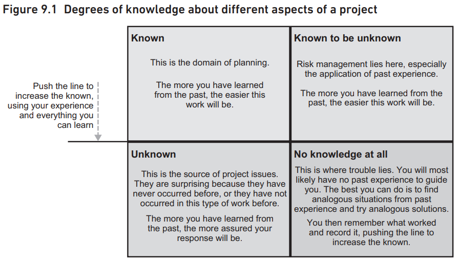
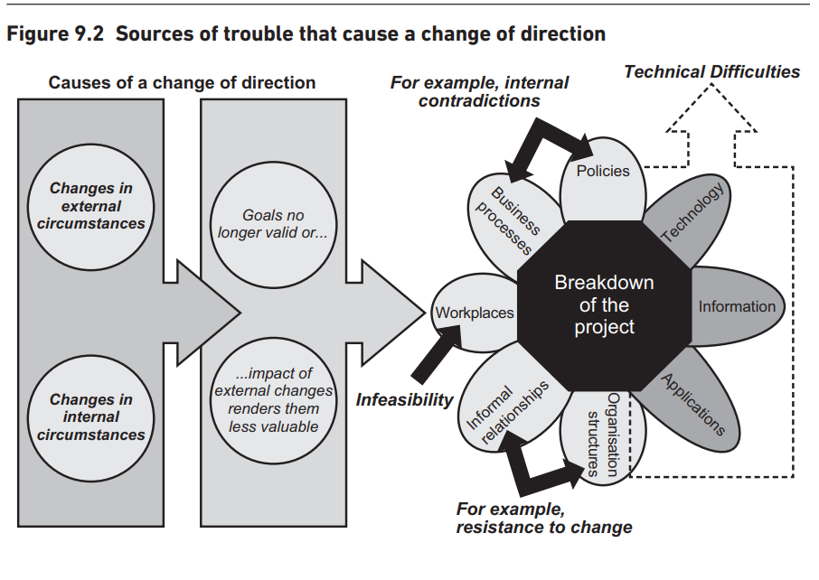
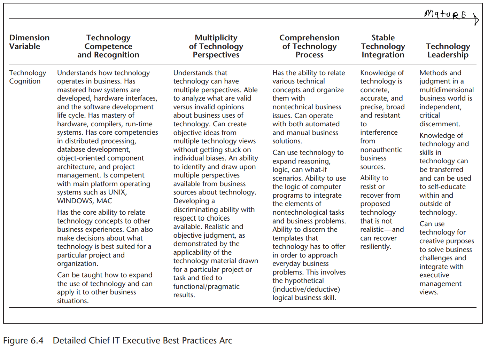
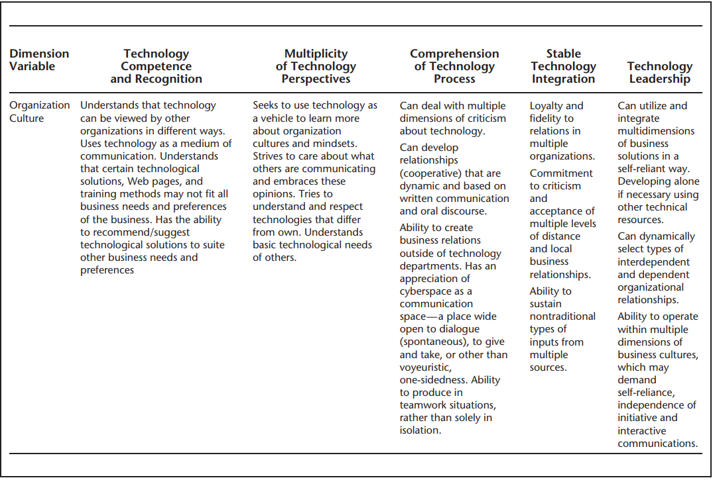
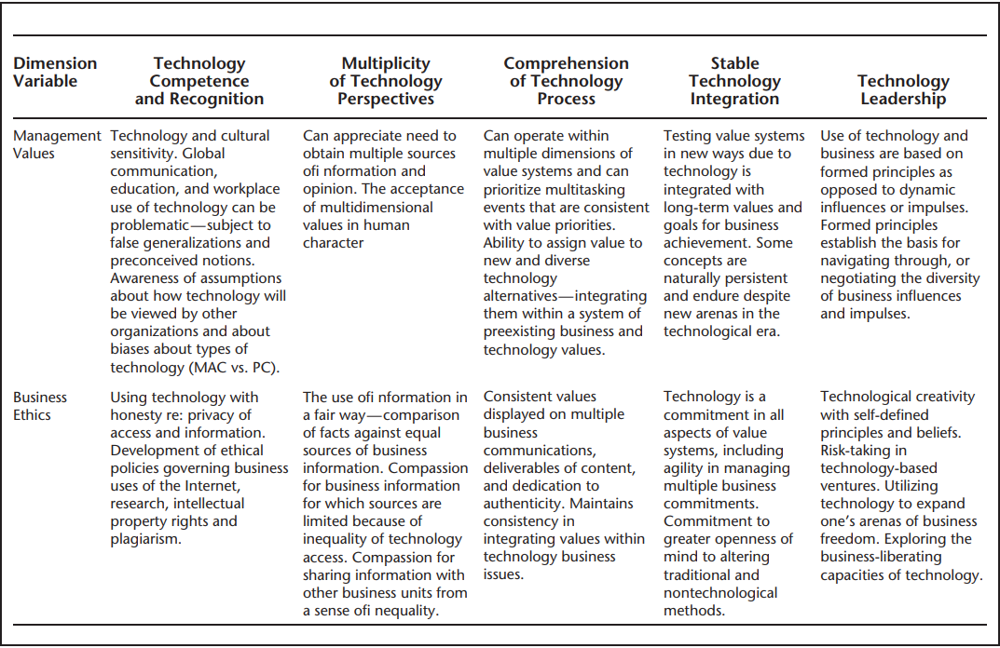
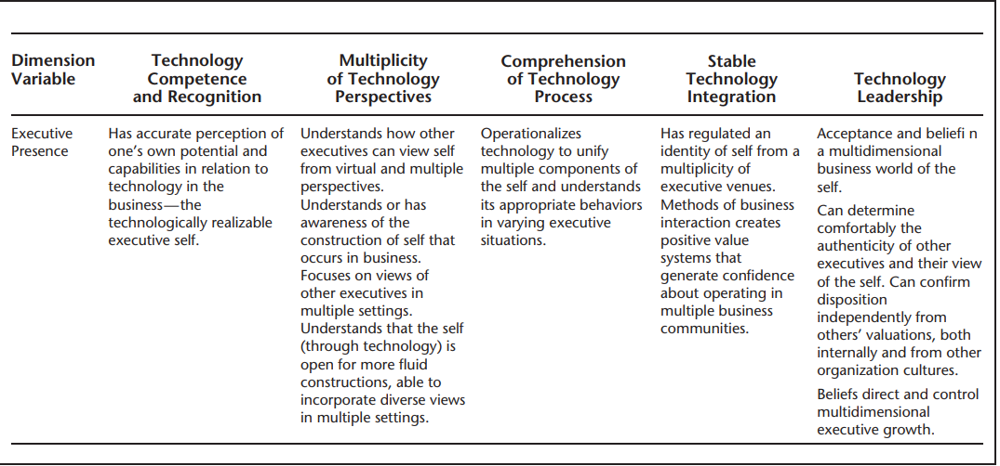

# Readings

## Implementing world class IT strategy  (2014)

High, P. A., & Passerini, F. (2014). Implementing world class IT strategy : how IT can drive organizational innovation. Jossey-Bass. [ProQuest](https://ebookcentral.proquest.com/lib/ncent-ebooks/detail.action?docID=1771577#). [Implementing_WorldClass_IT_ch8](Implementing_WorldClass_IT_ch8.pdf).

Chapter 8, **The Challenging Work Ahead**, states that being a CIO is hardwork.  The authors continue with a recanting of ADP's, CIO who started before the 2008 recession.  While his primary goal was cost optimization, he continued a small group with focus on innovation.  That team discovered that mobile was an emerging market with lots of potential.  Now, mobile is the primary platform for ADP's customer interactions.

This discussion builds into their principal point, that plans are in-valuable, though almost always wrong.  Without a plan, there is no mechanism for corralling the organization and moving in a uniform fashion.

## Managing IT projects for business change  (2013)

Morgan, J. (Project manager), & Dale, C. (2013). Managing IT projects for business change : from risk to success. BCS, The Chartered Institute for IT. [ProQuest](https://ebookcentral.proquest.com/lib/ncent-ebooks/detail.action?docID=1213993#). [Managing_IT_Projects_ch9](Managing_IT_Projects_ch9.pdf).

Chapter 9 of this book covers **Dealing with Trouble**. _You usually find out about trouble in one of two ways – by complete surprise or by early realisation. You should attempt to eliminate the former completely by looking ahead and having a sensitive and effective issue management process. [...] You should always attempt to reduce areas of uncertainty. The following examples illustrate what actions can be taken to build a first line of defence_ (pg 174-5)

The chapter also discusses sources of trouble, which can include internal and external factors.  When those changes occur, the business must mitigate the situtation -- often with money.  This situtation requires communication and collaboration with senior management, who can inturn approve modifying the goals and timelines.  However, there a nuances to this problem, such as which aspects to modify and how much.

## Strategic IT (2013)

Langer, A. M., & Yorks, L. (2013). Strategic IT. [electronic resource] : best practices for managers and executives. Wiley. [ProQuest](https://ebookcentral.proquest.com/lib/ncent-ebooks/detail.action?docID=1158348#). [Strategic_IT_ch6](Strategic_IT_ch6.pdf).

Chapter 6, **Lessons Learned and Best Practices**, lays the foundation for the formation of ‘‘best practices’’ to formalize the necessary attributes for rising to the CIO level and, more important, sustaining a leadership role.

### What are the five pillars of success for CIOs

1. **Communication is king**. No question, those `CIOs that learn to effectively articulate information technology (IT) from a business perspective are winning the day`. The discourse must be business lingo, not IT-converted speak. The more your language fits with those you support and help, the better you will integrate IT in the business. The question becomes how to speak the speak? CIOs recommend that CIOs `spend time in the business`. This is not just making trips, rather actually `visiting the firm’s clients and being part of production activities`. In this way you can actually understand the true culture of the business and can develop insights to how IT can truly provide value. Typically, the more visibility you have as a CIO, the easier it is to sell your ideas and determine what you need to do to maximize support from the field.

2. **Help define your role**. This was an interesting point made by several CIOs. They stated that many chief executive officers (CEOs), chief operating officers (COO), and chief financial officers (CFOs) may not have the vision to understand what IT can really do to help the firm—and more important what your role needs to be to help accomplish your plan. CIOs need `to help define their role—especially as a more strategic partner`. We know that too many CIOs are viewed as the backend support function, keeping the lights on; however, `firms need the strategic direction of how IT can make a difference competitively`. Their point was simple: if you wait to be asked, you may never receive the call. You need to sell your plan to senior management on how the CIO function can be used to help the business on the front end as well as the back end. Inevitably, the acceptance of such a plan can lead to redefining the CIO role and especially where it reports.

3. **Be patient!** Change in organizations takes time. `Integration can take longer than you expect. Organization culture evolves slowly`, but if the change occurs organically it will be more permanent. Remember that IT is a disruptive force—meaning that it affects employees, especially their roles and responsibilities. We know that `organizations do not like change`—so it should be no surprise that a new innovation proposed by the CIO may not be openly embraced—but in time things can and will change. Those CIOs that are `impatient and righteous do not last long`.

4. **Persevere**. Don’t think every idea will be accepted. More important, `you likely don’t get everything you ask for the first time`. Every presenter spoke about their failures—and how much they learned from them. In many cases, it led `the way to their success because they were able to rebound`. Remember, anyone can sail a ship in calm waters, but you can never be a true captain until you sail through a storm! The most important aspect of perseverance is to `always be impressive in how you handle yourself` and explain your challenges to your C-level partners.

5. **Costs are important**. Many CIOs think that showing how IT can reduce costs is the name of the game. Perhaps, but our presenters were `more focused on good fiscal control and sensitivity to expenditures` than necessarily taking out costs for the sake of it. What your chief executive and board need to know is that `you are a good businessperson, and establishing fiscal controls in your organization` is the first test for any C-level person. The difference in fiscal control is that it does not necessarily rule out smart investment and acceptable risk taking. Remember `the bottom line has two parts—revenues and expenses`!

### How are the chief technology officers

- **Chief information officer (CIO)**. This individual is usually the most senior IT executive in an organization, although not every organization has such a person. The CIO is not necessarily the most technical of people or even someone who has come through the ‘‘ranks’’ of IT. Instead, this individual is considered an executive who understands how technology needs to be integrated within the organization.

- **Chief technology officer (CTO)**. This individual, unlike the CIO, is very much a senior technical person. The role of the CTO is to ensure that the organization is using the best and most cost-effective technology to achieve its goals.

- **Chief knowledge officer (CKO)**.  In its purist role, the CKO is responsible for developing an overall infrastructure for managing knowledge, including intellectual capital, sharing of information, and worker communication.

### What are the maturity levels

